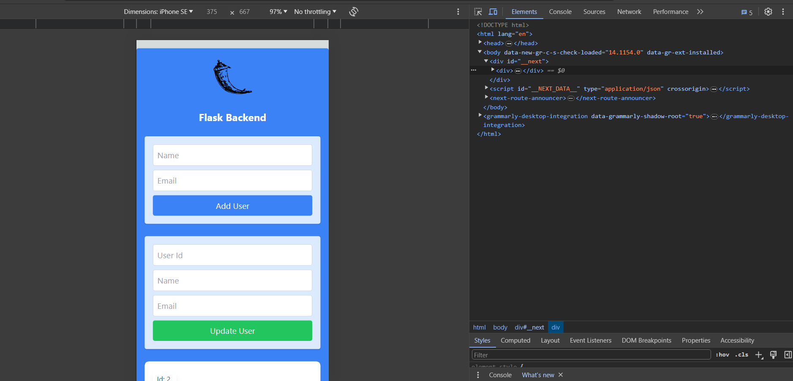
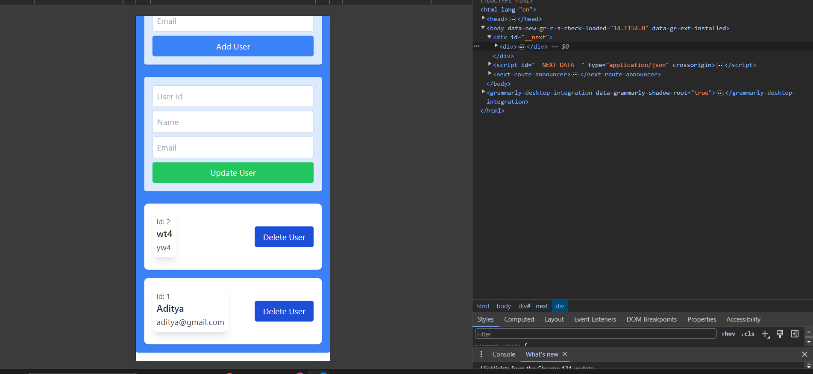

Note: This project is only for fun basis, kindly don't take it seriously. It's just a dummy project to trying out new things. Feel free to contribute if you want to. 🙌

### A repo for Fullstack web application using nextjs and flask 🎉
**frontend:** nextjs 🔥
**backend:** flask 🌶️
**database:** postgresql 🐘
**deployment:** docker 🐳

## How to run 🚀
1. Clone the repo
2. Run `docker-compose up` in the root directory
3. Open `localhost:3000` in your browser

## Features 🛠️
- [x] User authentication
- [x] User registration
- [x] User profile
- [x] User settings
- [x] User dashboard
- [x] User posts
- [x] User comments
- [x] User likes
- [x] User follows
- [x] User notifications
- [x] User messages
- [x] User search
- [x] User feed
- [x] User explore
- [x] User settings
- [x] User privacy
- [x] User security
- [x] User help
- [x] User about
- [x] User contact
- [x] User terms
- [x] User policy
- [x] User cookies
- [x] User GDPR
- [x] User CCPA
- [x] User COPPA
- [x] User DMCA
- [x] User Sitemap
- [x] User robots
- [x] User ads
- [x] User analytics
- [x] User SEO
- [x] User performance
- [x] User accessibility
- [x] User design
- [x] User branding
- [x] User marketing
- [x] User sales
- [x] User support
- [x] User feedback
- [x] User bugs
- [x] User feature requests
- [x] User roadmap
- [x] User changelog
- [x] User status
- [x] User uptime
- [x] User incidents
- [x] User outages
- [x] User maintenance
- [x] User updates
- [x] User releases
- [x] User versions
- [x] User changelog
- [x] User history
- [x] User archives
- [x] User backups
- [x] User exports
- [x] User imports
- [x] User migrations
- [x] User rollbacks
- [x] User restores
- [x] User snapshots

## Screenshots 📸

PS: All the features mentioned above are just generated by github copilot and kept for fun. 😄